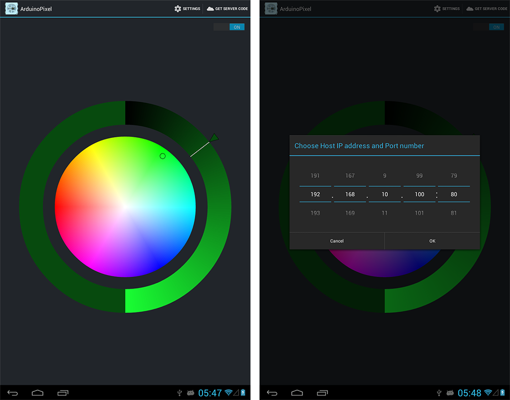

ArduinoPixel
============

ArduinoPixel is a distributed system for operating a LED strip. On one side, there is an **Arduino sketch** that implements a **web server** and offers an **API** for controlling a [NeoPixel LED strip](http://www.adafruit.com/products/1138). On the other side, there is the `ArduinoPixel` **Android app** that connects to the Arduino web server and sends **requests** to control the LED strip.

 

The **Arduino sketch** is almost ready for use, but you'll need to **tweak** a few parameters first. Once you update the network and strip parameters, you are free to **upload** the code straight to your board. Any Arduino compatible board with an Ethernet or Wifi connection should work fine.

The **Android app** is available on the [Google Play Store](https://play.google.com/store/apps/details?id=ln.paign10.arduinopixel). **Install** the app on your phone or tablet, **configure** the network parameters you set in the Arduino sketch and you are **ready** to go. You can watch a demo of the app [here](http://www.youtube.com/watch?v=AuqOQ0Pe_c0).

API
---

The web server offers an API to:
* Get info about the strip
* Turn the strip on and off
* Change the color of the strip
* Change what is being displayed on the strip

For more information, see [here](arduino_code/README.md).

Support
-------

The Arduino code has been tested on Arduino Uno, Leonardo, and Mega with a WIZnet W5100 Ethernet module. The Android app has been tested on a tablet with Android v4.1.1. There is also experimental support for ESP32.

I have made the decision to focus more on functionality and less on support for small boards. Keep in mind that as development progresses and new features are being added, the code will keep growing and thus need more space in memory to operate. If you upload the code to your board and the strip is not working, try lowering the number of LEDs until you observe the desired behaviour.

In my own experiments, the code functioned properly with 112 LEDs on Arduino Leonardo and Mega, but on Arduino Uno it maxed out at 80+ LEDs.

Although the project started with NeoPixel LEDs in mind, it has evolved to be able to support any LED strip. You only need to define a class for the strip and conform to the required API. If interested, see [led_strip_base.h](arduino_code/ArduinoPixel/src/led_strip/led_strip_base.h).

The project also supports changing what is being displayed on the strip with modes. Currently, the following modes are available: SINGLE_COLOR, SCANNER, RAINBOW, RAINBOW_CYCLE. Once again, you are able to add your own modes, as long as you conform to the required API. If interested, see [mode_base.h](arduino_code/ArduinoPixel/src/mode/mode_base.h). The Android app doesn't yet support controlling the modes.

Attribution
-----------

The **Android app** makes use of **Piotr Adamus'** [ColorPicker](https://github.com/chiralcode/Android-Color-Picker) view.

**Thank you Piotr**... with your **beautiful** work, you gave me the motivation I needed to attempt this project.
